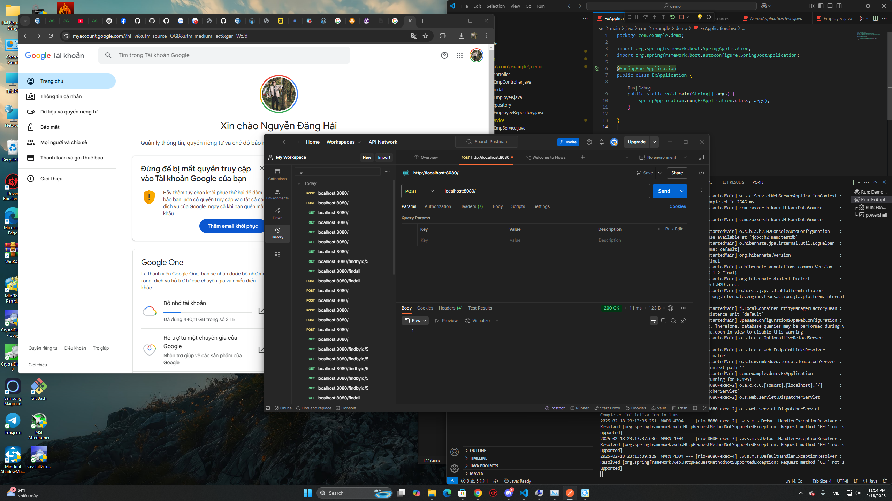
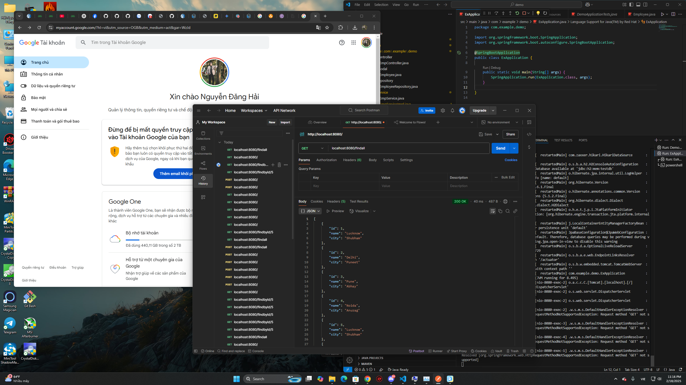
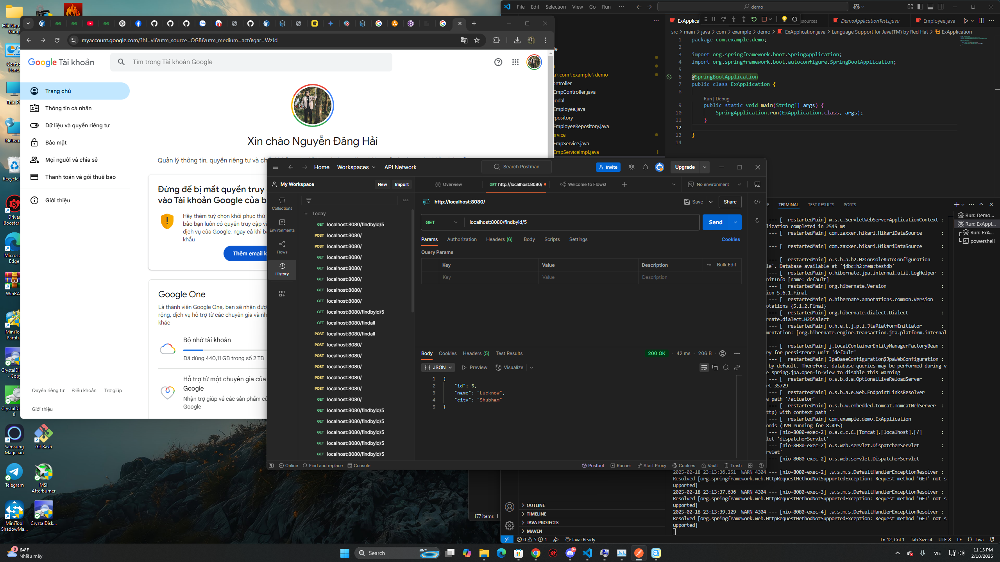

# Spring Data JPA

## Hướng dẫn chạy project
Để chạy project Spring Boot sử dụng Spring Data JPA cần thực hiện các bước sau:

### **1. Cài đặt môi trường**
Trước khi chạy project, đảm bảo đã cài đặt các công cụ sau:
- **Java 17+** (hoặc phiên bản Java phù hợp với Spring Boot)
- **Maven** (Để kiểm tra, chạy lệnh `mvn -v` trên terminal)
- **Postman** (Để thực hiện các request API)
- **VS Code hoặc IntelliJ IDEA** (Để chỉnh sửa code nếu cần)

### **2. Chạy project**
Mở terminal và điều hướng đến thư mục chứa project, sau đó chạy lệnh:
```sh
mvn clean spring-boot:run
```
Lệnh này sẽ:
- Xóa các file biên dịch cũ
- Biên dịch lại toàn bộ project
- Chạy ứng dụng Spring Boot trên **port 8080**

---

## **Hướng dẫn sử dụng API với Postman**
Dưới đây là các bước minh chứng rằng API hoạt động đúng:

### **Bước 1: Thêm dữ liệu Employee**
- Mở Postman, chọn phương thức `POST`
- Nhập URL: `http://localhost:8080/`
- Bấm **Send** để gửi yêu cầu


> Hình ảnh trên cho thấy quá trình gửi request `POST` để tạo danh sách Employee ban đầu.

---

### **Bước 2: Hiển thị toàn bộ Employee**
- Chọn phương thức `GET`
- Nhập URL: `http://localhost:8080/findall`
- Bấm **Send**


> Hình ảnh trên cho thấy danh sách Employee đã được thêm thành công.

---

### **Bước 3: Tìm Employee theo ID**
- Chọn phương thức `GET`
- Nhập URL: `http://localhost:8080/findbyid/1` (Thay `1` bằng ID mong muốn)
- Bấm **Send**


> Hình ảnh trên hiển thị thông tin của Employee có ID cụ thể.

---

### **Bước 4: Xóa toàn bộ Employee**
- Chọn phương thức `DELETE`
- Nhập URL: `http://localhost:8080/delete`
- Bấm **Send**


> Hình ảnh trên cho thấy việc gửi request `DELETE` để xóa toàn bộ dữ liệu Employee.

---

### **Bước 5: Kiểm tra dữ liệu sau khi xóa**
- Chọn phương thức `GET`
- Nhập URL: `http://localhost:8080/findall`
- Bấm **Send**


> Hình ảnh trên chứng minh rằng danh sách Employee đã bị xóa hoàn toàn.

---

Bài làm của: Nguyễn Đăng Hải - MSV 22024532
